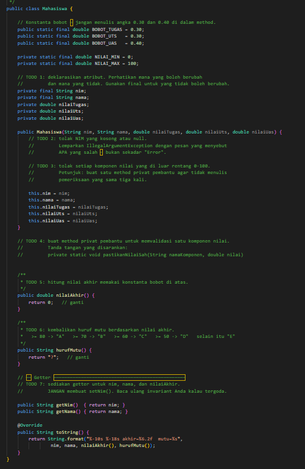
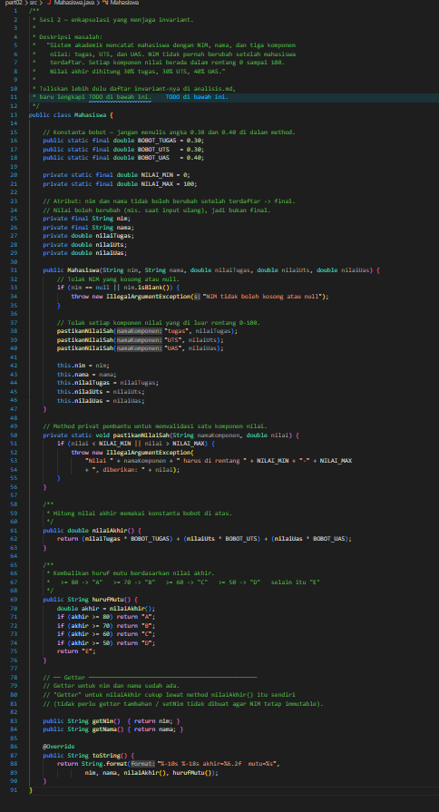
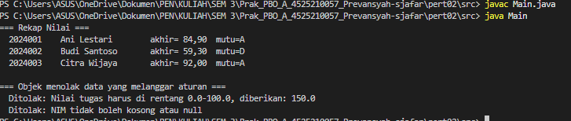
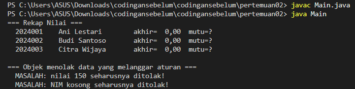
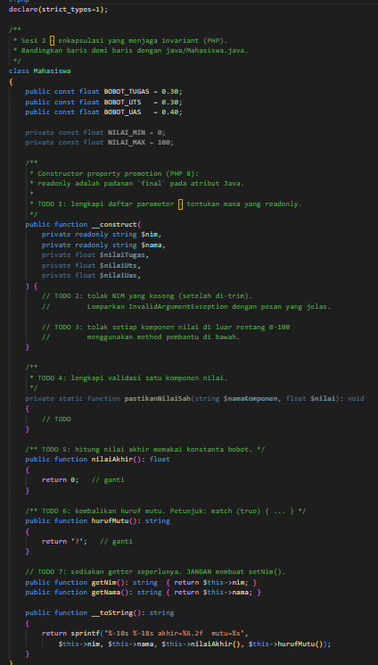
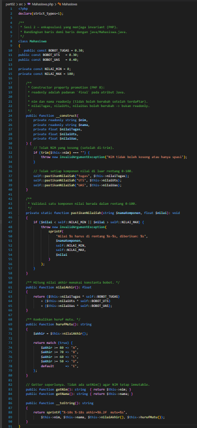
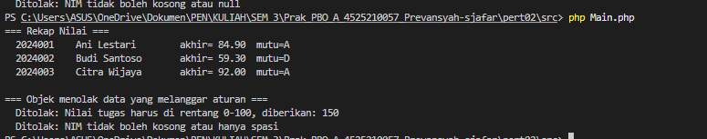
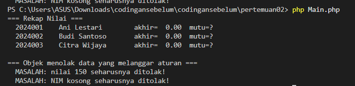

# LAPORAN PRAKTIKUM PEMROGRAMAN BERBASIS OBJEK

| Informasi Praktikan | Keterangan |
| :--- | :--- |
| **Nama** | *Prevansyah Sjafar* |
| **NPM** | *4525210057* |
| **Kelas** | A |
| **Mata Kuliah** | Pemrograman Berbasis Objek (PBO) |
| **Pertemuan** | 02 - Kelas, Objek, dan Enkapsulasi |
| **Tanggal** | *Kamis 10 September 2026* |
| **Dosen Pengampu** | *Adi Wahyu Pribadi, S.Si., M.Kom	* |
---

## 1. Implementasi Java

### 1.1. File: `Mahasiswa.java`
**Penjelasan Kode:**
> Kelas `Mahasiswa` menerapkan enkapsulasi untuk menjaga invariant: NIM tidak berubah setelah terdaftar, setiap komponen nilai berada di rentang 0 sampai 100, dan nilai akhir dihitung dengan bobot 30% tugas, 30% UTS, 40% UAS.
> Atribut `nim` dan `nama` dibuat `private final` sehingga tidak bisa diganti setelah objek dibuat, dan tidak disediakan `setNim()`. Bobot dan batas nilai disimpan sebagai konstanta (`BOBOT_TUGAS`, `BOBOT_UTS`, `BOBOT_UAS`, `NILAI_MIN`, `NILAI_MAX`) agar tidak ada angka ajaib di dalam method.
> Constructor menolak NIM `null` atau kosong dengan `IllegalArgumentException`, lalu memvalidasi tiga nilai lewat satu method privat `pastikanNilaiSah()` supaya pemeriksaan yang sama tidak ditulis tiga kali. Method `nilaiAkhir()` menjumlahkan nilai dikali bobot, dan `hurufMutu()` memetakan nilai akhir ke A (>= 80), B (>= 70), C (>= 60), D (>= 50), selain itu E.

**Bukti Eksekusi (Screenshot):**
* **Before** *(Kondisi awal / Kesalahan kompilasi)*:

*Kondisi awal berupa kerangka dengan banyak TODO. `nilaiAkhir()` masih `return 0` dan `hurufMutu()` masih `return "?"`, serta belum ada validasi.*

* **After** *(Kondisi akhir / Eksekusi berhasil)*:

*Seluruh TODO sudah dilengkapi: atribut `final`, validasi di constructor, method `pastikanNilaiSah()`, perhitungan nilai akhir, dan huruf mutu.*

### 1.2. File: `Main.java`
**Penjelasan Kode:**
> Program uji yang membuat tiga objek `Mahasiswa` dan mencetak rekap nilainya lewat `toString()`. Setelah itu dua objek dengan data tidak sah dicoba dibuat: nilai tugas 150 dan NIM kosong. Keduanya harus ditolak dengan `IllegalArgumentException`, dan pesan kesalahannya dicetak. Jika objek berhasil dibuat, program mencetak "MASALAH" yang menandakan validasi belum bekerja.

**Bukti Eksekusi (Screenshot):**
* Tidak ada perubahan kode pada file ini (program uji). Bukti eksekusi sebelum dan sesudah ada pada bagian **Output** di bawah.

### Output
**Output Program:**

*Setelah dilengkapi, nilai akhir terhitung benar (Ani 84,90 mutu A; Budi 59,30 mutu D; Citra 92,00 mutu A), nilai 150 dan NIM kosong ditolak dengan pesan yang jelas.*

**Pembanding, output sebelum kode dilengkapi:**

*Sebelum kode dilengkapi, nilai akhir semua mahasiswa 0,00 dengan mutu "?", dan data tidak sah tidak ditolak (muncul pesan MASALAH).*

---

## 2. Implementasi PHP

### 2.1. File: `Mahasiswa.php`
**Penjelasan Kode:**
> Padanan PHP dari `Mahasiswa.java`. Properti `nim` dan `nama` memakai `private readonly` lewat constructor property promotion (PHP 8), yang setara dengan `final` di Java. Tiga nilai bersifat `private float` karena boleh berubah.
> Bobot dan batas nilai dideklarasikan sebagai `const` kelas. Constructor menolak NIM kosong (setelah `trim`) dengan `InvalidArgumentException`, lalu memanggil `pastikanNilaiSah()` untuk tiap komponen nilai. `hurufMutu()` memakai ekspresi `match (true)` sebagai pengganti rangkaian `if` di Java. `__toString()` menggantikan `toString()` dan tidak ada `setNim()` agar NIM tetap immutable.

**Bukti Eksekusi (Screenshot):**
* **Before** *(Kondisi awal / Galat logika)*:

*Kondisi awal masih kerangka TODO: perhitungan nilai akhir dan huruf mutu belum diisi, validasi belum ada.*

* **After** *(Kondisi akhir / Eksekusi berhasil)*:

*Validasi, `nilaiAkhir()`, dan `hurufMutu()` dengan `match` sudah lengkap.*

### 2.2. File: `main.php`
**Penjelasan Kode:**
> Program uji PHP yang setara dengan `Main.java`. File ini memuat `Mahasiswa.php` dengan `require_once`, mencetak rekap tiga mahasiswa, lalu menguji dua data tidak sah (nilai 150 dan NIM kosong) di dalam blok `try ... catch (InvalidArgumentException)`.

**Bukti Eksekusi (Screenshot):**
* Tidak ada perubahan kode pada file ini (program uji). Bukti eksekusi sebelum dan sesudah ada pada bagian **Output** di bawah.

### Output
**Output Program:**

*Setelah dilengkapi, hasil sama dengan versi Java: nilai akhir dan mutu benar, nilai 150 dan NIM kosong ditolak.*

**Pembanding, output sebelum kode dilengkapi:**

*Sebelum dilengkapi, nilai akhir 0.00 dan mutu "?" untuk semua mahasiswa, serta data tidak sah masih lolos.*

---

## 3. Kesimpulan
> Praktikum ini menunjukkan bahwa enkapsulasi bukan sekadar membuat atribut `private`, melainkan menjaga agar objek tidak pernah berada dalam keadaan tidak sah. Invariant (NIM tetap, nilai 0 sampai 100) ditegakkan di satu tempat, yaitu constructor, sehingga objek yang melanggar aturan tidak akan pernah terbentuk.
> Java memakai `final` dan PHP memakai `readonly` untuk atribut yang tidak boleh berubah. Konstanta bernama dan method privat pembantu membuat kode lebih mudah dibaca dan dirawat. Hasil Java dan PHP identik, hanya sintaksnya yang berbeda.
