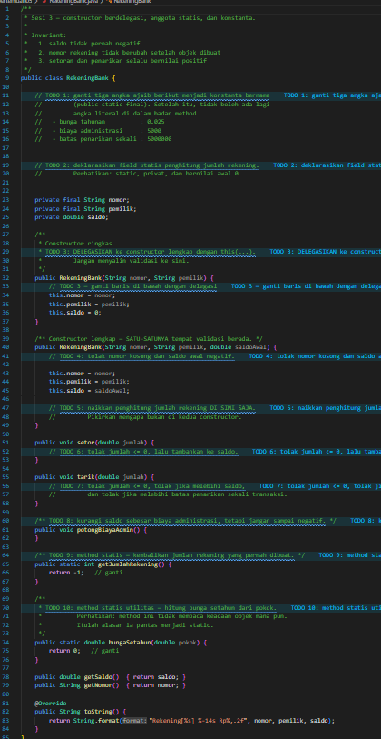
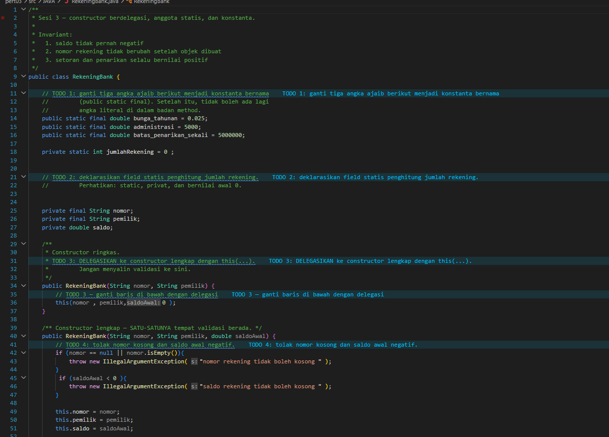
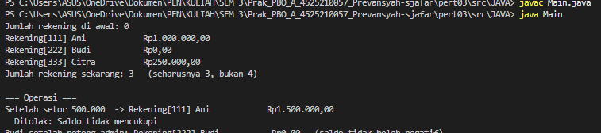
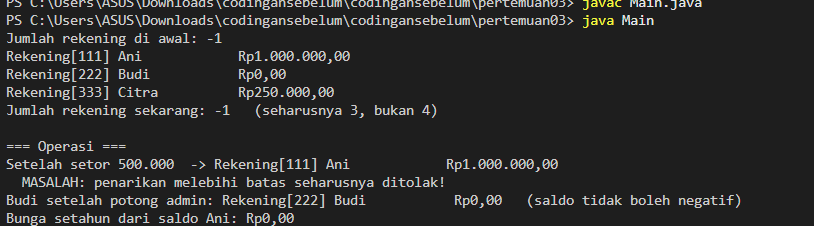
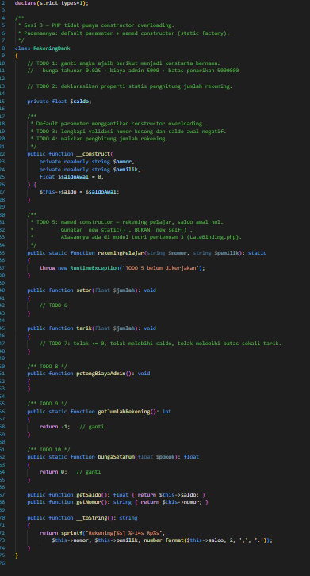
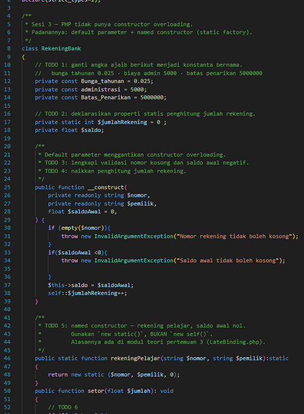
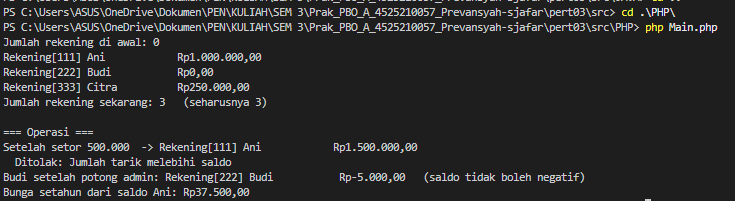
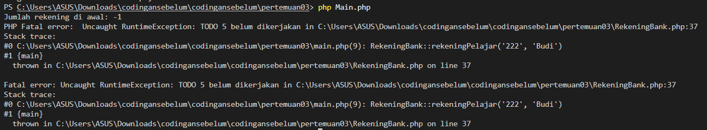

# LAPORAN PRAKTIKUM PEMROGRAMAN BERBASIS OBJEK

| Informasi Praktikan | Keterangan |
| :--- | :--- |
| **Nama** | *Prevansyah Sjafar* |
| **NPM** | *4525210057* |
| **Kelas** | A |
| **Mata Kuliah** | Pemrograman Berbasis Objek (PBO) |
| **Pertemuan** | 03 - Construktor, Anggota Statis, dan Konstanta |
| **Tanggal** | *Kamis 17 September 2026* |
| **Dosen Pengampu** | *Adi Wahyu Pribadi, S.Si., M.Kom	* |

---

## 1. Implementasi Java

### 1.1. File: `RekeningBank.java`
**Penjelasan Kode:**
> Kelas `RekeningBank` menjaga tiga invariant: saldo tidak pernah negatif, nomor rekening tidak berubah setelah dibuat, dan setoran serta penarikan selalu positif.
> Angka ajaib diganti konstanta `public static final` (`bunga_tahunan` 0,025, `administrasi` 5000, `batas_penarikan_sekali` 5.000.000). Field `jumlahRekening` bersifat `private static` dengan nilai awal 0.
> Constructor ringkas `(nomor, pemilik)` mendelegasikan ke constructor lengkap lewat `this(nomor, pemilik, 0)`. Constructor lengkap adalah satu-satunya tempat validasi (nomor kosong dan saldo awal negatif) dan juga satu-satunya tempat `jumlahRekening++`. Karena itu penghitung hanya naik satu kali per objek, bukan dua kali.
> `setor()` menolak jumlah <= 0. `tarik()` menolak jumlah <= 0, jumlah di atas saldo, dan jumlah di atas batas sekali transaksi. `potongBiayaAdmin()` memakai `Math.max(0, ...)` agar saldo tidak negatif. `getJumlahRekening()` dan `bungaSetahun()` adalah method `static` karena tidak membaca keadaan objek tertentu.

**Bukti Eksekusi (Screenshot):**
* **Before** *(Kondisi awal / Kesalahan kompilasi)*:

*Kondisi awal berupa kerangka TODO: konstanta belum ada, penghitung belum dideklarasikan, dan method masih placeholder. Output awal menunjukkan jumlah rekening -1 dan bunga Rp0.*

* **After** *(Kondisi akhir / Eksekusi berhasil)*:

*Semua TODO sudah dikerjakan: konstanta, field statis, constructor berdelegasi, validasi, dan method statis.*

### 1.2. File: `Main.java`
**Penjelasan Kode:**
> Program uji yang membuat tiga rekening (dua dengan constructor lengkap, satu dengan constructor ringkas), lalu menampilkan jumlah rekening yang harus 3 (bukan 4). Program kemudian menguji setoran, penarikan yang melebihi batas (harus ditolak), pemotongan biaya admin pada saldo 0 (saldo tidak boleh negatif), dan perhitungan bunga setahun lewat method statis.

**Bukti Eksekusi (Screenshot):**
* Tidak ada perubahan kode pada file ini (program uji). Bukti eksekusi sebelum dan sesudah ada pada bagian **Output** di bawah.

### Output
**Output Program:**

*Setelah dilengkapi, jumlah rekening awal 0 dan menjadi 3, saldo Ani menjadi Rp1.500.000,00 setelah setor, penarikan berlebih ditolak, dan saldo Budi tetap Rp0,00 setelah potong admin.*

**Pembanding, output sebelum kode dilengkapi:**

*Sebelum dilengkapi, jumlah rekening bernilai -1, saldo tidak bertambah setelah setor, penarikan berlebih tidak ditolak, dan bunga Rp0,00.*

---

## 2. Implementasi PHP

### 2.1. File: `RekeningBank.php`
**Penjelasan Kode:**
> Padanan PHP dari `RekeningBank.java`. PHP tidak punya constructor overloading, jadi digunakan default parameter `float $saldoAwal = 0` pada constructor, ditambah named constructor `rekeningPelajar()` yang membuat rekening dengan saldo awal nol. Named constructor memakai `new static(...)`, bukan `new self(...)`, agar kelas turunan menghasilkan objek bertipe turunan (late static binding).
> Konstanta (`Bunga_tahunan`, `administrasi`, `Batas_Penarikan`) dideklarasikan dengan `private const`, penghitung dengan `private static int $jumlahRekening`. Constructor memvalidasi nomor kosong dan saldo awal negatif, lalu menaikkan penghitung. `setor()` dan `tarik()` melakukan validasi yang sama dengan versi Java.
> Pada `potongBiayaAdmin()`, saldo dikurangi langsung sebesar biaya administrasi tanpa batas bawah 0.

**Bukti Eksekusi (Screenshot):**
* **Before** *(Kondisi awal / Galat logika)*:

*Kondisi awal berupa kerangka TODO. Output awal menampilkan Fatal error "TODO 5 belum dikerjakan" karena `rekeningPelajar()` belum diimplementasikan.*

* **After** *(Kondisi akhir / Eksekusi berhasil)*:

*Named constructor, validasi, penghitung statis, dan method statis sudah lengkap sehingga program berjalan sampai selesai.*

### 2.2. File: `main.php`
**Penjelasan Kode:**
> Program uji PHP yang setara dengan `Main.java`. Rekening Budi dibuat lewat named constructor `RekeningBank::rekeningPelajar()`, sedangkan Ani dan Citra lewat `new`. Alur pengujiannya sama: cek jumlah rekening, setor, tarik melebihi batas dalam blok `try ... catch`, potong biaya admin, dan hitung bunga setahun.

**Bukti Eksekusi (Screenshot):**
* Tidak ada perubahan kode pada file ini (program uji). Bukti eksekusi sebelum dan sesudah ada pada bagian **Output** di bawah.

### Output
**Output Program:**

*Setelah dilengkapi, program berjalan penuh: jumlah rekening 0 lalu 3, saldo Ani Rp1.500.000,00 setelah setor, penarikan berlebih ditolak, dan bunga setahun Rp37.500,00.*

**Pembanding, output sebelum kode dilengkapi:**

*Sebelum dilengkapi, program berhenti dengan Fatal error "TODO 5 belum dikerjakan" pada `rekeningPelajar()` dan jumlah rekening awal bernilai -1.*

---

## 3. Kesimpulan
> Praktikum ini memperlihatkan bagaimana constructor berdelegasi (`this(...)` di Java) menghindari duplikasi validasi, sehingga aturan hanya ada di satu tempat dan penghitung `jumlahRekening` tidak naik dua kali. Anggota `static` dipakai untuk data yang dimiliki kelas (penghitung) dan untuk method utilitas yang tidak bergantung pada objek (`bungaSetahun`). Konstanta bernama menggantikan angka ajaib.
> Karena PHP tidak mendukung overloading, padanannya adalah default parameter dan named constructor dengan `new static()`. Pada versi PHP, `potongBiayaAdmin()` belum membatasi saldo agar tidak negatif seperti versi Java, sehingga hal ini perlu diperbaiki agar invariant "saldo tidak negatif" tetap terjaga.
