# LAPORAN PRAKTIKUM PEMROGRAMAN BERBASIS OBJEK

| Informasi Praktikan | Keterangan |
| :--- | :--- |
| **Nama** | *Prevansyah Sjafar* |
| **NPM** | *4525210057* |
| **Kelas** | A |
| **Mata Kuliah** | Pemrograman Berbasis Objek (PBO) |
| **Pertemuan** |04 - Inheritance |
| **Tanggal** | *Kamis 24 September 2026* |
| **Dosen Pengampu** | *Adi Wahyu Pribadi, S.Si., M.Kom	* |

---

## 1. Implementasi Java

### 1.1. File: `Pegawai.java`
**Penjelasan Kode:**
> Kelas induk `abstract` yang menampung hal yang sama untuk semua jenis pegawai: `nip`, `nama`, dan `gajiPokok` (dibuat `protected final` agar bisa dibaca turunan tetapi tidak dari luar). Constructor menolak gaji pokok negatif. `hitungGaji()` mengembalikan gaji pokok apa adanya sebagai perilaku dasar yang akan ditambah oleh turunan. `jenis()` adalah method `abstract` sehingga setiap turunan wajib menyebutkan jenisnya sendiri, dan `toString()` memakai keduanya untuk mencetak satu baris data.

**Bukti Eksekusi (Screenshot):**
* **Before** *(Kondisi awal / Kesalahan kompilasi)*:
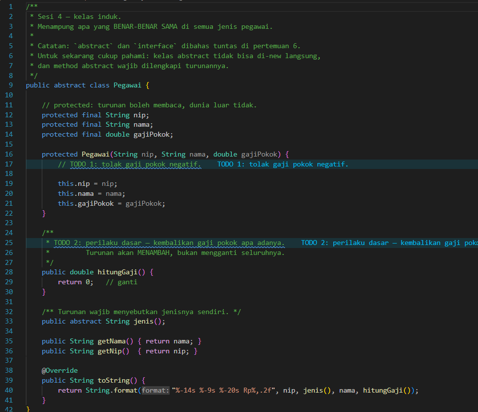

*Kondisi awal masih TODO: validasi gaji negatif belum ada dan `hitungGaji()` masih placeholder (`return 0`), sehingga seluruh gaji tercetak Rp0,00.*

* **After** *(Kondisi akhir / Eksekusi berhasil)*:
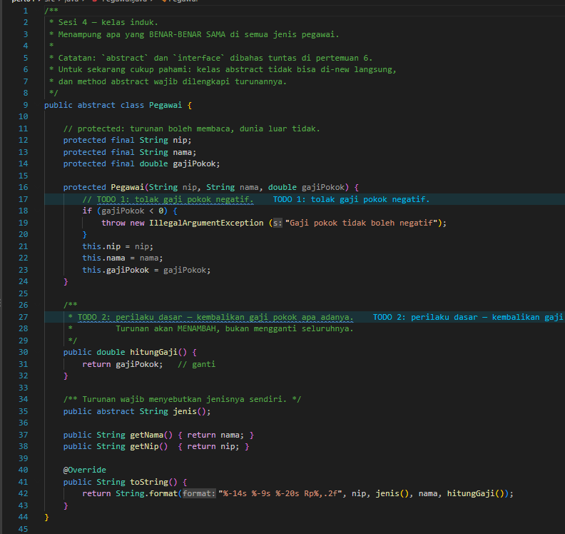

*Validasi gaji negatif dan `hitungGaji()` yang mengembalikan `gajiPokok` sudah dilengkapi.*

### 1.2. File: `PegawaiTetap.java`
**Penjelasan Kode:**
> Turunan `Pegawai` untuk pegawai tetap. Constructor memanggil `super(nip, nama, gajiPokok)` sebagai pernyataan pertama (wajib karena induk tidak punya constructor tanpa parameter). `hitungGaji()` di-override: gaji dasar diambil dari `super.hitungGaji()`, bukan menyalin rumus induk, lalu ditambah tunjangan masa kerja sebesar 2% per tahun dengan batas maksimum 40% (`Math.min`). Untuk Ani (6.000.000, 15 tahun) hasilnya 6.000.000 x 1,30 = 7.800.000.

**Bukti Eksekusi (Screenshot):**
* **Before** *(Kondisi awal / Kesalahan kompilasi)*:
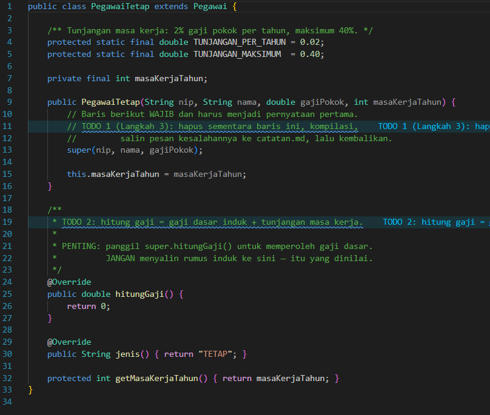

*Kondisi awal: `hitungGaji()` masih `return 0` sehingga tunjangan belum dihitung.*

* **After** *(Kondisi akhir / Eksekusi berhasil)*:
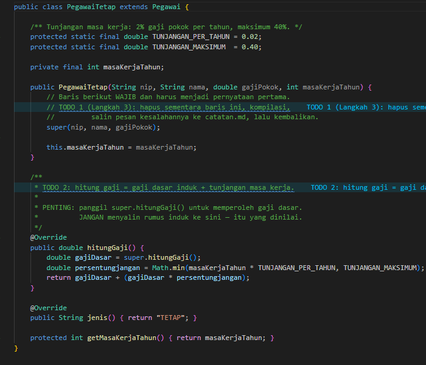

*`hitungGaji()` sudah memanggil `super.hitungGaji()` dan menambahkan tunjangan masa kerja dengan batas 40%.*

### 1.3. File: `PegawaiKontrak.java`
**Penjelasan Kode:**
> Turunan `Pegawai` untuk pegawai kontrak dengan atribut tambahan `bulanKontrak`. Pegawai kontrak tidak mendapat tunjangan masa kerja, sehingga `hitungGaji()` tidak perlu di-override dan memakai versi induk (gaji pokok apa adanya). Class ini hanya mengimplementasikan `jenis()` yang mengembalikan "KONTRAK".

**Bukti Eksekusi (Screenshot):**
* **Before** *(Kondisi awal / Kesalahan kompilasi)*:
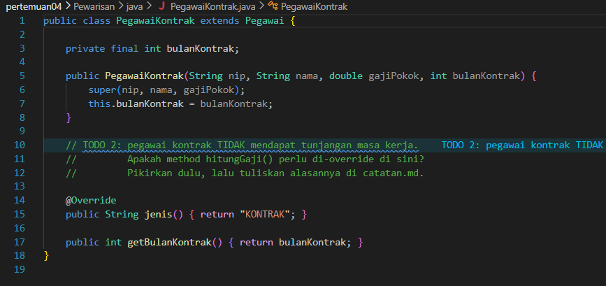

*Kondisi awal berisi catatan TODO yang meminta mempertimbangkan apakah `hitungGaji()` perlu di-override.*

* **After** *(Kondisi akhir / Eksekusi berhasil)*:
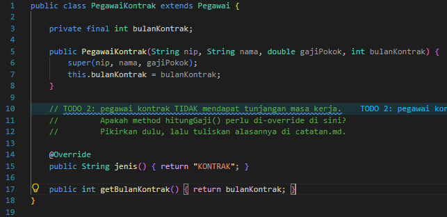

*Keputusan akhir: tidak di-override karena perilaku induk sudah sesuai.*

### 1.4. File: `Main.java`
**Penjelasan Kode:**
> Program uji yang menyimpan `PegawaiTetap` dan `PegawaiKontrak` dalam array bertipe `Pegawai[]` (upcasting). Perulangan mencetak setiap pegawai dan menjumlahkan `hitungGaji()` menjadi total beban gaji. Method yang dipanggil ditentukan oleh jenis objek sebenarnya (polimorfisme).

**Bukti Eksekusi (Screenshot):**
* **Before** *(Kondisi awal / Kesalahan kompilasi)*:
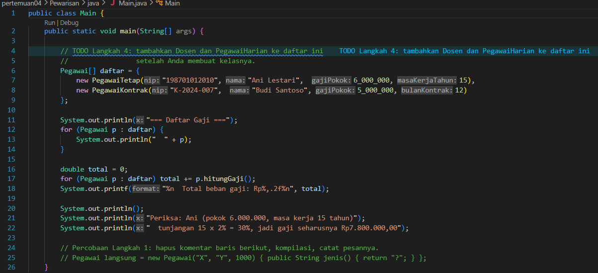

*Kondisi awal: daftar pegawai dan perhitungan total masih berupa TODO.*

* **After** *(Kondisi akhir / Eksekusi berhasil)*:
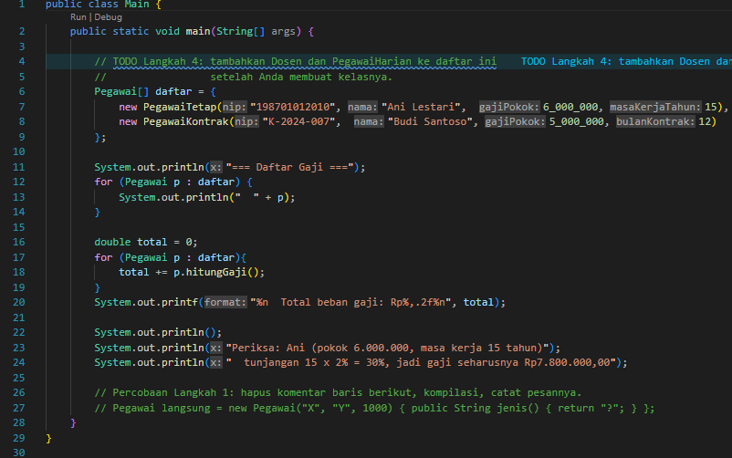

*Perulangan penjumlahan total gaji sudah ditulis sehingga total beban gaji tercetak.*

### Output
**Output Program:**
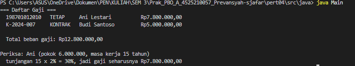

*Setelah dilengkapi, Ani menerima Rp7.800.000,00 sesuai tulisan "Periksa", Budi Rp5.000.000,00, dan total beban gaji Rp12.800.000,00.*

**Pembanding, output sebelum kode dilengkapi:**
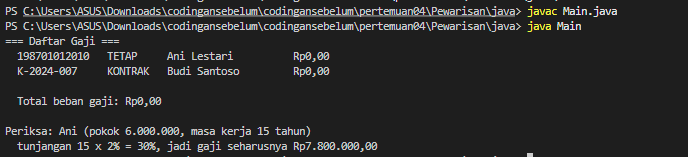

*Sebelum dilengkapi, gaji semua pegawai Rp0,00 dan total Rp0,00.*

---

## 2. Implementasi PHP

### 2.1. File: `Pegawai.php`
**Penjelasan Kode:**
> Seluruh hierarki pegawai ditaruh dalam satu file. `Pegawai` adalah kelas `abstract` dengan properti `protected readonly` dan validasi gaji pokok negatif. `PegawaiTetap` memanggil `parent::__construct(...)` dan menghitung gaji dari `parent::hitungGaji()` dikali (1 + tunjangan masa kerja, maksimum 40%). `PegawaiKontrak` tidak meng-override `hitungGaji()`.
> Pada langkah lanjutan ditambahkan dua kelas baru. `Dosen` adalah turunan `PegawaiTetap` dengan tunjangan fungsional 10% di atas gaji tetap. `PegawaiHarian` menghitung gaji sebagai gaji per hari dikali jumlah hari kerja.

**Bukti Eksekusi (Screenshot):**
* **Before** *(Kondisi awal / Galat logika)*:
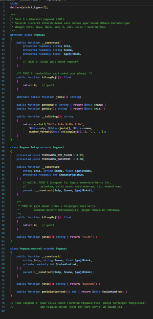

*Kondisi awal masih kerangka TODO: validasi belum ada, `hitungGaji()` belum benar, dan kelas Dosen serta PegawaiHarian belum dibuat.*

* **After** *(Kondisi akhir / Eksekusi berhasil)*:
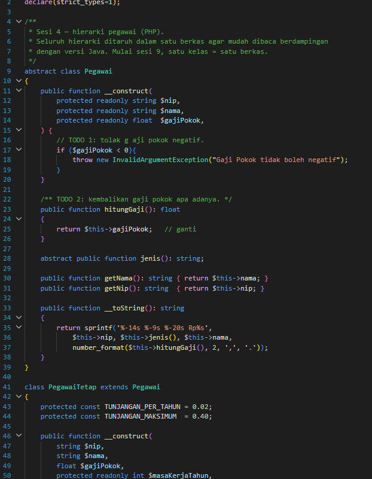

*Semua TODO terisi, termasuk kelas `Dosen` dan `PegawaiHarian`.*

### 2.2. File: `main.php`
**Penjelasan Kode:**
> Program uji PHP. Daftar berisi empat objek: `PegawaiTetap`, `PegawaiKontrak`, `Dosen`, dan `PegawaiHarian`. Setiap objek dicetak lewat `__toString()`, dan total beban gaji dihitung dengan `array_sum(array_map(...))` tanpa pemeriksaan tipe apa pun.

**Bukti Eksekusi (Screenshot):**
* **Before** *(Kondisi awal / Galat logika)*:
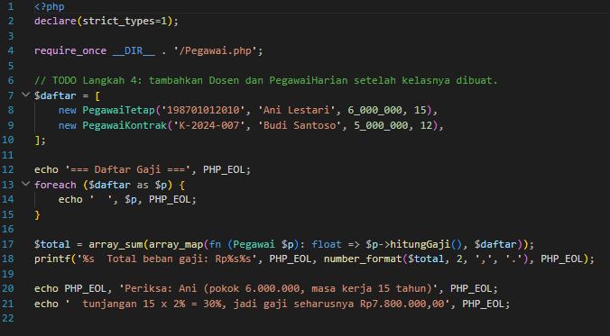

*Kondisi awal: baru dua pegawai di daftar dan TODO untuk menambah Dosen serta PegawaiHarian.*

* **After** *(Kondisi akhir / Eksekusi berhasil)*:
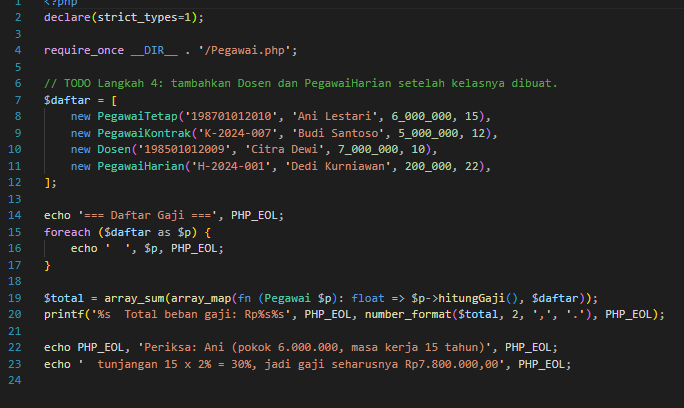

*Daftar sudah memuat empat jenis pegawai.*

### Output
**Output Program:**
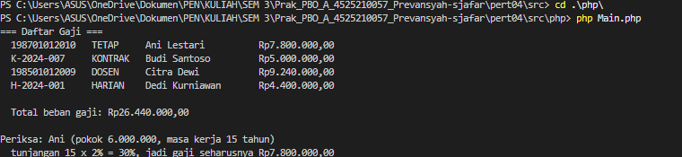

*Setelah dilengkapi, Ani Rp7.800.000,00, Budi Rp5.000.000,00, Citra (Dosen) Rp9.240.000,00, Dedi (Harian) Rp4.400.000,00, dan total beban gaji Rp26.440.000,00.*

**Pembanding, output sebelum kode dilengkapi:**
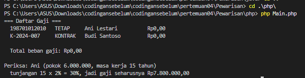

*Sebelum dilengkapi, gaji semua pegawai Rp0,00 dan total Rp0,00.*

---

## 3. Kesimpulan
> Pewarisan memungkinkan perilaku yang sama ditempatkan di kelas induk (`Pegawai`) sementara turunan hanya menambah atau mengubah bagian yang berbeda. Turunan memakai `super.hitungGaji()` (Java) atau `parent::hitungGaji()` (PHP) untuk mengambil gaji dasar tanpa menyalin rumus. Constructor turunan wajib memanggil constructor induk. Jika `hitungGaji()` tidak perlu diubah, seperti pada `PegawaiKontrak`, tidak perlu di-override.
> Dengan array bertipe induk, pegawai baru seperti `Dosen` dan `PegawaiHarian` bisa ditambahkan tanpa mengubah logika perulangan maupun penghitungan total gaji.
