# LAPORAN PRAKTIKUM PEMROGRAMAN BERBASIS OBJEK

| Informasi Praktikan | Keterangan |
| :--- | :--- |
| **Nama** | *Prevansyah Sjafar* |
| **NPM** | *4525210057* |
| **Kelas** | A |
| **Mata Kuliah** | Pemrograman Berbasis Objek (PBO) |
| **Pertemuan** |05 - Polimerfisme|
| **Tanggal** | *Kamis 1 Oktober 2026* |
| **Dosen Pengampu** | *Adi Wahyu Pribadi, S.Si., M.Kom	* |

---

## 1. Implementasi Java

### 1.1. File: `BangunDatar.java`
**Penjelasan Kode:**
> Kelas induk `abstract` yang menetapkan kontrak: setiap bangun datar wajib punya `luas()` dan `keliling()`. Method `toString()` berada di induk tetapi memanggil `luas()` dan `keliling()` yang isinya baru ada di turunan. Hal ini bisa terjadi karena dynamic dispatch: Java memilih method sesuai jenis objek sebenarnya saat program berjalan.

**Bukti Eksekusi (Screenshot):**
* Tidak ada screenshot terpisah untuk file ini. Hasil eksekusinya terlihat pada bagian **Output** di bawah.

### 1.2. File: `Lingkaran.java`
**Penjelasan Kode:**
> Turunan `BangunDatar` dengan atribut `jariJari`. Constructor menolak jari-jari <= 0. `luas()` memakai `Math.PI * r * r` dan `keliling()` memakai `2 * Math.PI * r`, bukan angka 3,14 agar presisi terjaga. `getJariJari()` dibutuhkan untuk bagian downcasting di `Main`.

**Bukti Eksekusi (Screenshot):**
* **Before** *(Kondisi awal / Kesalahan kompilasi)*:
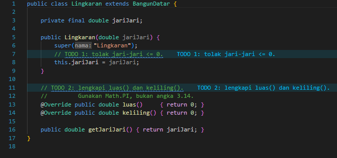

*Kondisi awal: validasi belum ada dan `luas()` serta `keliling()` masih TODO.*

* **After** *(Kondisi akhir / Eksekusi berhasil)*:
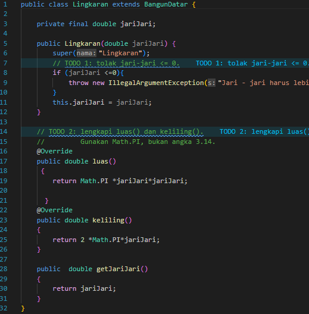

*Validasi dan rumus luas serta keliling sudah dilengkapi.*

### 1.3. File: `Persegi.java`
**Penjelasan Kode:**
> Turunan `BangunDatar` dengan atribut `sisi`. Constructor menolak sisi <= 0. `luas()` mengembalikan `sisi * sisi` dan `keliling()` mengembalikan `4 * sisi`.

**Bukti Eksekusi (Screenshot):**
* **Before** *(Kondisi awal / Kesalahan kompilasi)*:
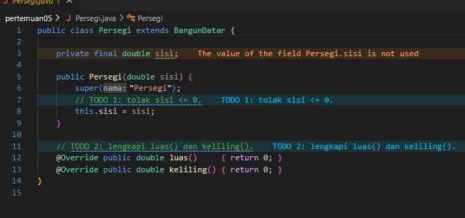

*Kondisi awal: validasi dan rumus masih TODO sehingga luas dan keliling tercetak 0,00.*

* **After** *(Kondisi akhir / Eksekusi berhasil)*:
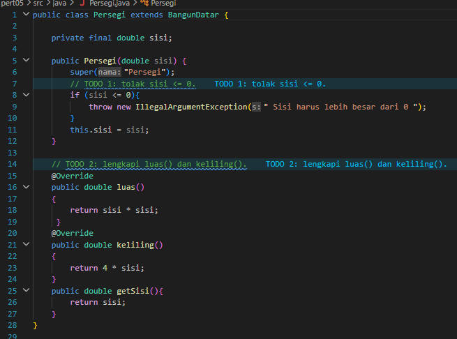

*Validasi dan rumus sudah dilengkapi.*

### 1.4. File: `Segitiga.java`
**Penjelasan Kode:**
> Bangun datar baru yang ditambahkan pada langkah 2 tanpa mengubah logika perulangan di `Main`. Menyimpan `alas`, `tinggi`, dan `sisiMiring`. `luas()` memakai `0.5 * alas * tinggi` dan `keliling()` menjumlahkan ketiga sisi. `toString()` di-override untuk menampilkan ukuran segitiga.

**Bukti Eksekusi (Screenshot):**
* File ini dibuat baru sehingga tidak ada kondisi before. Hasilnya terlihat pada bagian **Output** di bawah (Segitiga luas = 6,0).

### 1.5. File: `Trapesium.java`
**Penjelasan Kode:**
> Bangun datar keempat yang ditambahkan pada langkah 4. Menyimpan sisi atas, sisi bawah, tinggi, sisi kiri, dan sisi kanan. `luas()` memakai `0.5 * (atas + bawah) * tinggi` dan `keliling()` menjumlahkan keempat sisi. Seperti `Segitiga`, class ini cukup ditambahkan ke array di `Main` tanpa mengubah kode lain.

**Bukti Eksekusi (Screenshot):**
* File ini dibuat baru sehingga tidak ada kondisi before. Hasilnya terlihat pada bagian **Output** di bawah (Trapesium luas = 40,0 dengan tinggi 5).

### 1.6. File: `Main.java`
**Penjelasan Kode:**
> Program uji bertipe `BangunDatar[]` (upcasting) yang diisi `Lingkaran`, `Persegi`, `Segitiga`, dan `Trapesium`. Perulangan untuk mencetak dan menjumlahkan luas tidak diubah sama sekali, hanya isi array yang ditambah. Bagian akhir memakai `instanceof` untuk downcasting ke `Lingkaran` hanya ketika `getJariJari()` benar-benar dibutuhkan.

**Bukti Eksekusi (Screenshot):**
* **Before** *(Kondisi awal / Kesalahan kompilasi)*:
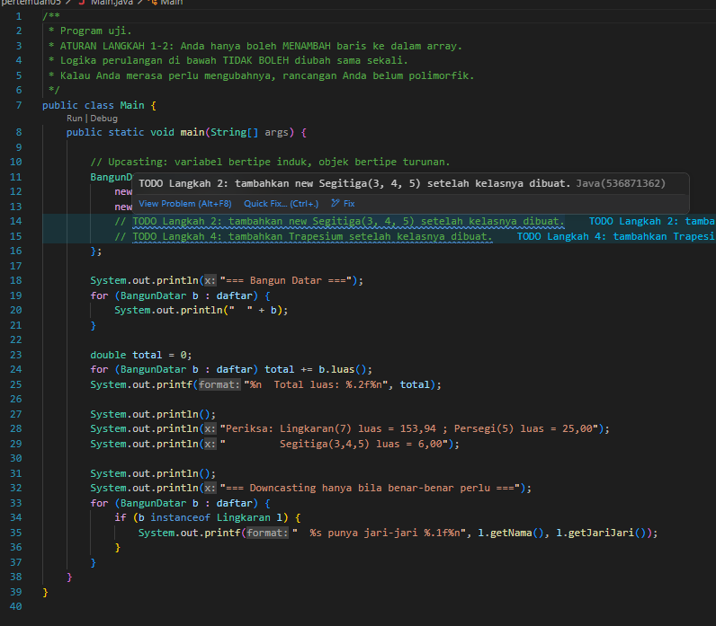

*Kondisi awal: array baru berisi Lingkaran dan Persegi, dan Segitiga serta Trapesium masih TODO.*

* **After** *(Kondisi akhir / Eksekusi berhasil)*:
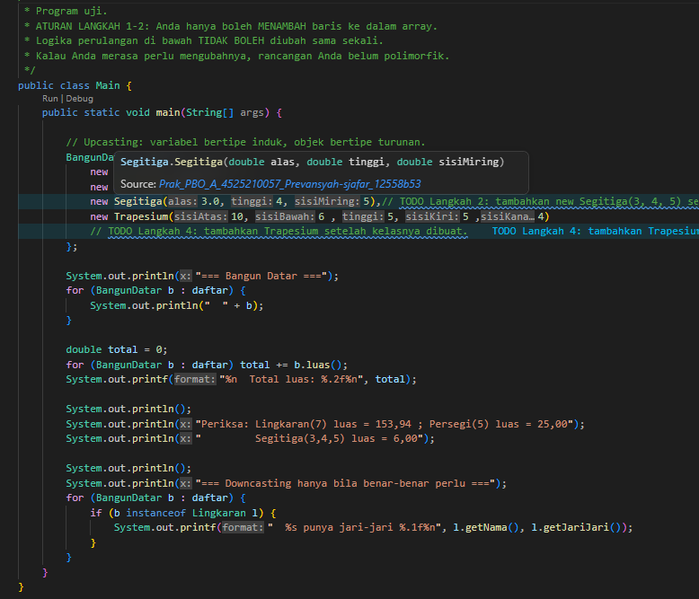

*Array sudah memuat empat bangun datar.*

### 1.7. File: `AntiPattern.java dan AntiPatternRefaktor.java`
**Penjelasan Kode:**
> `AntiPattern.java` adalah versi tanpa polimorfisme: satu method `hitungLuas(Object)` berisi rangkaian `if ... instanceof`, sehingga setiap bangun baru memaksa method itu disunting dan satu cabang yang terlupa akan memicu exception. `AntiPatternRefaktor.java` memperbaikinya dengan `interface Bangun` yang punya `luas()`, dan tiap `record` mengimplementasikannya sendiri. Pengetahuan cara menghitung luas kini berada di tiap bangun, bukan di method pusat.

**Bukti Eksekusi (Screenshot):**
* Tidak ada screenshot terpisah untuk file ini (latihan refaktor). Hasil eksekusinya terlihat pada bagian **Output** di bawah.

### Output
**Output Program:**
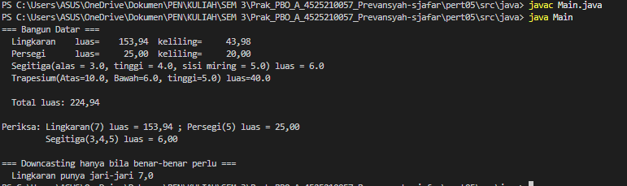

*Setelah dilengkapi, Lingkaran luas 153,94, Persegi 25,00, Segitiga 6,0, Trapesium 40,0, dan total luas 224,94. Bagian downcasting menampilkan jari-jari Lingkaran 7,0.*

**Pembanding, output sebelum kode dilengkapi:**
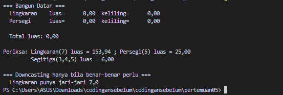

*Sebelum dilengkapi, luas dan keliling Lingkaran dan Persegi tercetak 0,00 dan total luas 0,00.*

---

## 2. Implementasi PHP

### 2.1. File: `BangunDatar.php`
**Penjelasan Kode:**
> Berisi kelas abstrak `BangunDatar` beserta empat turunannya: `Lingkaran` (`M_PI`), `Persegi`, `Segitiga` (rumus Heron dan validasi ketaksamaan segitiga), dan `Trapesium`. Setiap turunan memvalidasi parameter di constructor dan mengisi `luas()` serta `keliling()`.
> Di bagian bawah file ada driver code yang mencetak daftar bangun. Karena `main.php` memuat file ini dengan `require_once`, kode tersebut ikut berjalan sehingga di output muncul satu blok hasil tambahan sebelum hasil dari `main.php`.

**Bukti Eksekusi (Screenshot):**
* **Before** *(Kondisi awal / Galat logika)*:
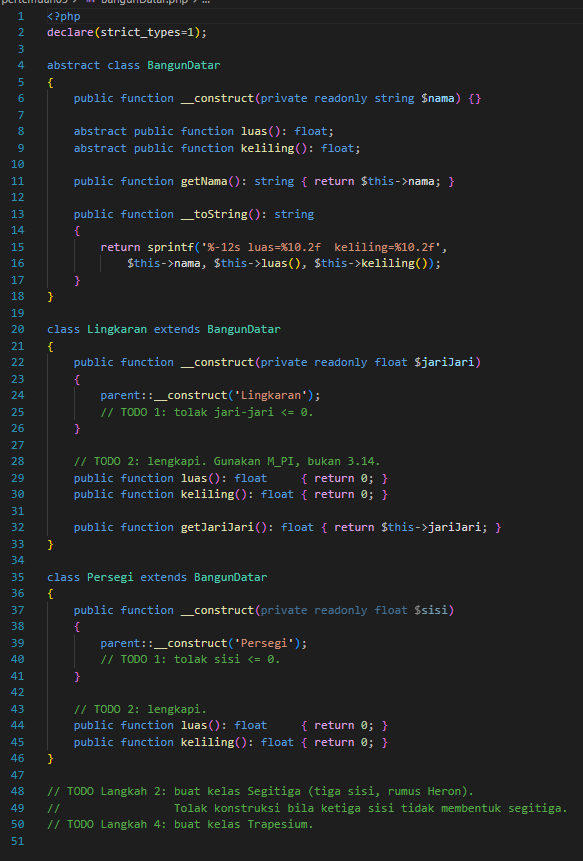

*Kondisi awal: hanya kerangka dengan TODO, belum ada validasi, rumus, maupun kelas Segitiga dan Trapesium.*

* **After** *(Kondisi akhir / Eksekusi berhasil)*:
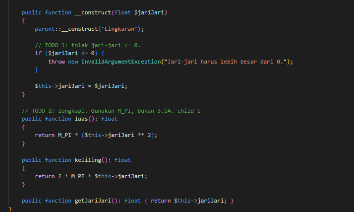

*Seluruh kelas turunan sudah dibuat dan dilengkapi.*

### 2.2. File: `main.php`
**Penjelasan Kode:**
> Program uji PHP dengan array `BangunDatar` berisi Lingkaran, Persegi, Segitiga, dan Trapesium. Hasil dicetak lewat `__toString()` dan total luas dihitung dengan `array_sum(array_map(...))` tanpa pemeriksaan tipe.

**Bukti Eksekusi (Screenshot):**
* **Before** *(Kondisi awal / Galat logika)*:
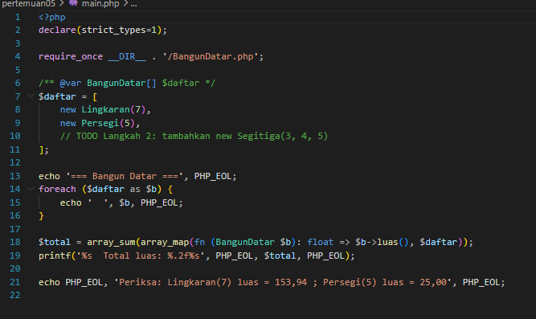

*Kondisi awal: array baru berisi dua bangun, dan Segitiga serta Trapesium masih TODO.*

* **After** *(Kondisi akhir / Eksekusi berhasil)*:
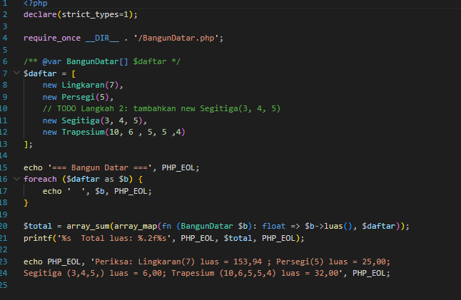

*Array sudah memuat empat bangun datar.*

### 2.3. File: `notifikasi.php`
**Penjelasan Kode:**
> Latihan mandiri polimorfisme. `Notifikasi` adalah kelas abstrak dengan properti `tujuan`, method abstrak `kirim(string $pesan)`, dan `saluran()`. Tiga turunan (`Email`, `SMS`, `WhatsApp`) masing-masing mencetak format pesan yang berbeda. Fungsi `kirimSemua()` hanya melakukan `foreach` dan memanggil `kirim()` tanpa `instanceof`, `match`, atau `switch`, karena PHP memilih implementasi sesuai kelas objeknya.

**Bukti Eksekusi (Screenshot):**
* **Before** *(Kondisi awal / Galat logika)*:
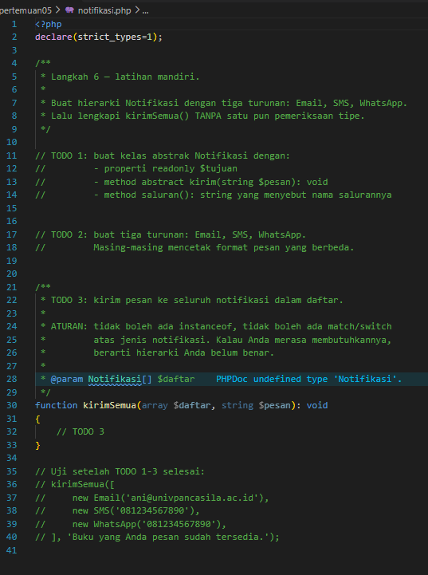

*Kondisi awal: hanya TODO yang menjelaskan hierarki yang harus dibuat.*

* **After** *(Kondisi akhir / Eksekusi berhasil)*:
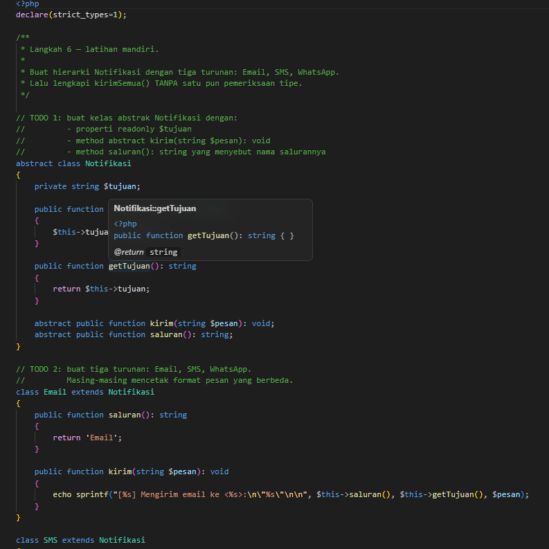

*Hierarki Notifikasi dan fungsi `kirimSemua()` sudah lengkap.*

### Output
**Output Program:**
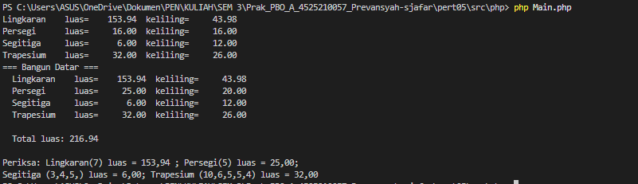

*Setelah dilengkapi, hasil muncul dua kali. Blok pertama berasal dari driver code di `BangunDatar.php` (Persegi sisi 4), blok kedua dari `main.php`. Total luas dari `main.php` adalah 216,94 dan Trapesium (10, 6, 5, 5, 4) berluas 32,00.*

**Pembanding, output sebelum kode dilengkapi:**
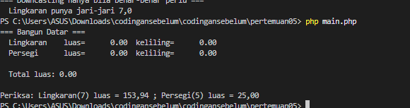

*Sebelum dilengkapi, luas dan keliling bernilai 0.00 dan total luas 0.00.*

---

## 3. Kesimpulan
> Polimorfisme membuat kode pemanggil cukup bergantung pada tipe induk (`BangunDatar`, `Notifikasi`), sementara cara kerja sebenarnya ditentukan oleh objek turunan saat program berjalan. Karena itu bangun datar baru (Segitiga, Trapesium) cukup ditambahkan sebagai kelas baru dan satu baris di array, tanpa mengubah perulangan. Latihan `AntiPattern` menunjukkan sisi sebaliknya: rangkaian `if ... instanceof` membuat setiap tipe baru memaksa sunting method pusat.
> Upcasting dipakai untuk menyimpan objek beragam dalam satu array, dan downcasting dengan `instanceof` hanya dipakai bila benar-benar perlu (mis. membaca jari-jari Lingkaran). Pada Trapesium, urutan parameter constructor berbeda antara versi Java dan PHP sehingga luasnya berbeda (40,0 dan 32,00) meskipun angka yang dimasukkan sama.
