# LAPORAN PRAKTIKUM PEMROGRAMAN BERBASIS OBJEK

| Informasi Praktikan | Keterangan |
| :--- | :--- |
| **Nama** | *Prevansyah Sjafar* |
| **NPM** | *4525210057* |
| **Kelas** | A |
| **Mata Kuliah** | Pemrograman Berbasis Objek (PBO) |
| **Pertemuan** |06 - Abstract, Class Interface, Enum|
| **Tanggal** | *Kamis 8 Oktober 2026* |
| **Dosen Pengampu** | *Adi Wahyu Pribadi, S.Si., M.Kom	* |

---

## 1. Implementasi Java

### 1.1. File: `Movable.java`
**Penjelasan Kode:**
> Interface yang menjawab "apa yang bisa dilakukan", bukan "apa benda ini". Berisi `bergerak()` dan `kecepatanMaksimum()`, ditambah `default` method `ringkasanGerak()` yang menyusun teks ringkasan dari `kecepatanMaksimum()`. Default method memberi implementasi bawaan yang boleh ditimpa implementornya.

**Bukti Eksekusi (Screenshot):**
* **Before** *(Kondisi awal / Kesalahan kompilasi)*:
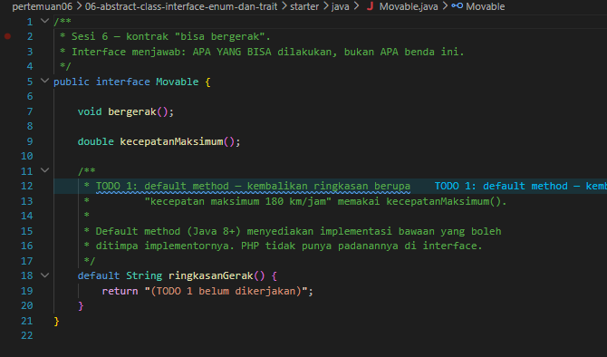

*Kondisi awal: `ringkasanGerak()` masih TODO sehingga output menampilkan "TODO 1 belum dikerjakan".*

* **After** *(Kondisi akhir / Eksekusi berhasil)*:
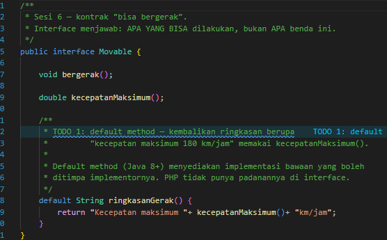

*Default method sudah menghasilkan teks "Kecepatan maksimum ... km/jam".*

### 1.2. File: `Fuelable.java`
**Penjelasan Kode:**
> Interface kontrak "bisa diisi bahan bakar" dengan `isiBahanBakar()`, `kapasitasTangki()`, dan `tipeBahanBakar()`. Sengaja dipisah dari `Movable` sesuai Interface Segregation Principle: tidak semua yang bergerak butuh bahan bakar (sepeda), dan tidak semua yang butuh bahan bakar bergerak (generator).

**Bukti Eksekusi (Screenshot):**
* Tidak ada perubahan kode pada file ini (sudah lengkap dari awal) dan tidak ada screenshot terpisah.

### 1.3. File: `Kendaraan.java`
**Penjelasan Kode:**
> Abstract class yang menampung kode yang benar-benar sama di semua kendaraan: `merek`, `tahun`, method `umur()` yang tidak pernah negatif (`Math.max(0, ...)`), method abstrak `jumlahRoda()`, dan `toString()`. Berbeda dengan interface, abstract class boleh menyimpan state dan constructor.

**Bukti Eksekusi (Screenshot):**
* **Before** *(Kondisi awal / Kesalahan kompilasi)*:
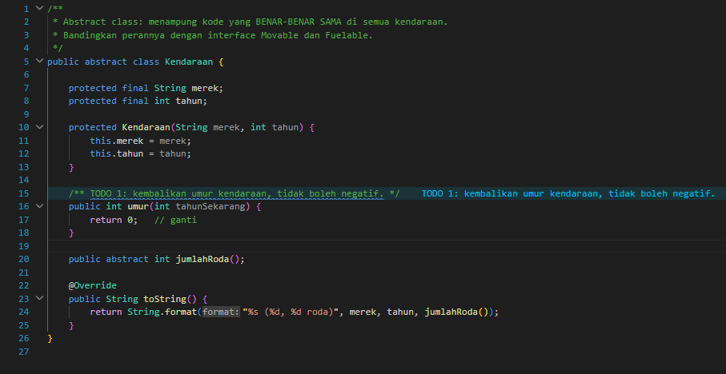

*Kondisi awal: `umur()` masih TODO.*

* **After** *(Kondisi akhir / Eksekusi berhasil)*:
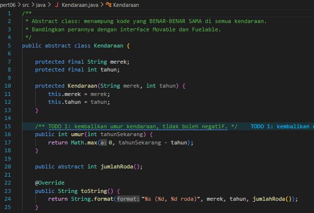

*`umur()` sudah dilengkapi dengan batas minimal 0.*

### 1.4. File: `Mobil.java`
**Penjelasan Kode:**
> `Mobil extends Kendaraan implements Movable, Fuelable`. Java hanya mengizinkan mewarisi satu class tetapi boleh mengimplementasikan banyak interface, untuk menghindari ambiguitas pewarisan state dari banyak induk (masalah diamond). `bergerak()` dan `kecepatanMaksimum()` (180) memenuhi `Movable`. `isiBahanBakar()` menolak jumlah <= 0 dan menolak pengisian yang melebihi kapasitas tangki, sedangkan `tipeBahanBakar()` mengembalikan `BENSIN`.

**Bukti Eksekusi (Screenshot):**
* **Before** *(Kondisi awal / Kesalahan kompilasi)*:
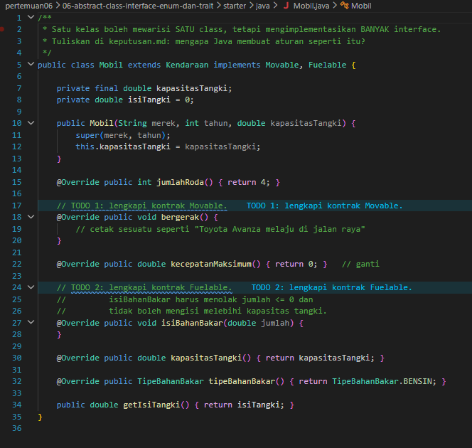

*Kondisi awal: method `Movable` dan `Fuelable` masih TODO.*

* **After** *(Kondisi akhir / Eksekusi berhasil)*:
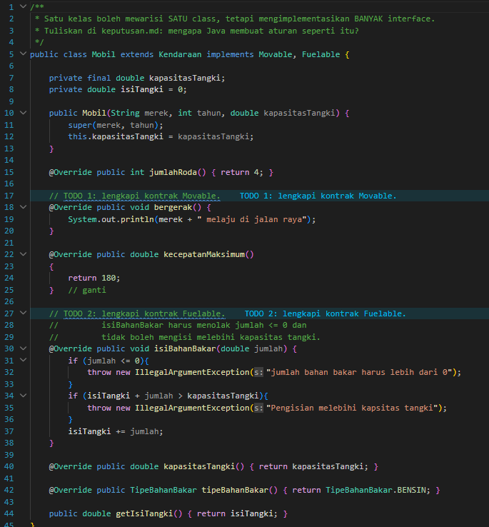

*Kontrak `Movable` dan `Fuelable` sudah dipenuhi, lengkap dengan validasi pengisian.*

### 1.5. File: `Sepeda.java`
**Penjelasan Kode:**
> `Sepeda extends Kendaraan implements Movable`, tetapi sengaja tidak mengimplementasikan `Fuelable` karena sepeda tidak butuh bahan bakar. Akibatnya `isiPenuh(sepeda)` akan ditolak oleh compiler, dan penolakan saat kompilasi ini menguntungkan karena kesalahan ketahuan sebelum program dijalankan.

**Bukti Eksekusi (Screenshot):**
* **Before** *(Kondisi awal / Kesalahan kompilasi)*:
*Belum ada. File ini dibuat baru pada langkah praktikum, jadi tidak ada kondisi awal.*

* **After** *(Kondisi akhir / Eksekusi berhasil)*:
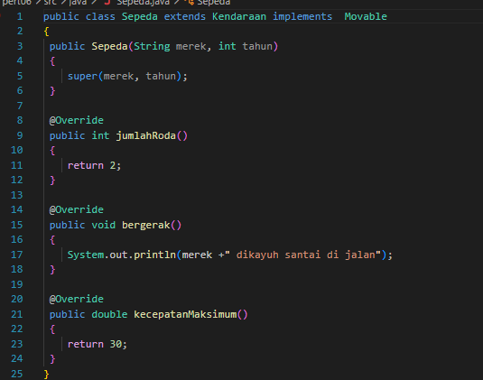

### 1.6. File: `TipeBahanBakar.java`
**Penjelasan Kode:**
> Enum yang hanya mengizinkan nilai terdaftar: `BENSIN` (Rp12.000), `SOLAR` (Rp10.500), dan `LISTRIK` (Rp2.500 per kWh). Tiap konstanta membawa `label` dan `hargaPerSatuan`. Enum juga punya perilaku: `biayaPengisian(jumlah)` mengalikan jumlah dengan harga dan `ramahLingkungan()` bernilai `true` hanya untuk `LISTRIK`. Ini tidak bisa dilakukan konstanta `int` biasa, yang membiarkan angka sembarang (mis. 99) lolos.

**Bukti Eksekusi (Screenshot):**
* **Before** *(Kondisi awal / Kesalahan kompilasi)*:
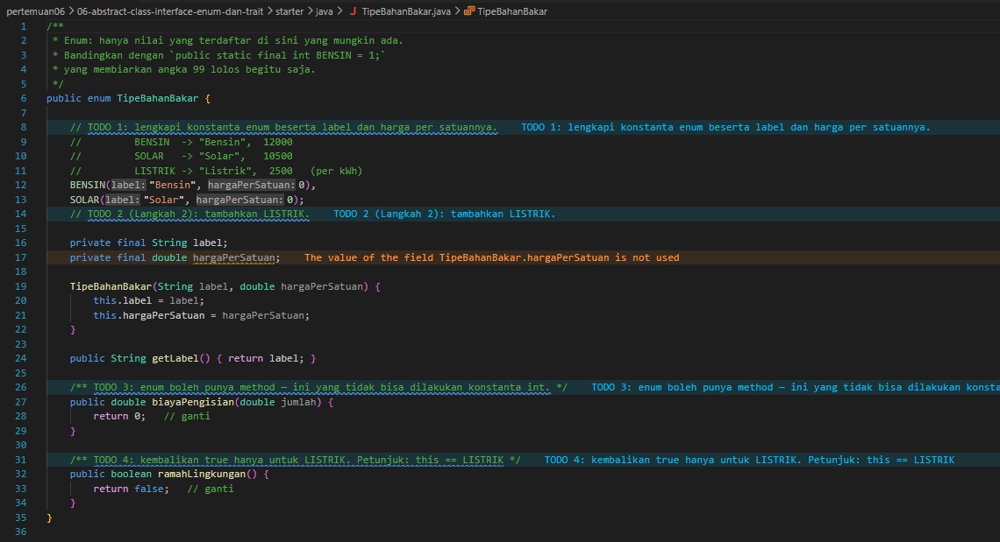

*Kondisi awal: konstanta enum, `biayaPengisian()`, dan `ramahLingkungan()` masih TODO.*

* **After** *(Kondisi akhir / Eksekusi berhasil)*:
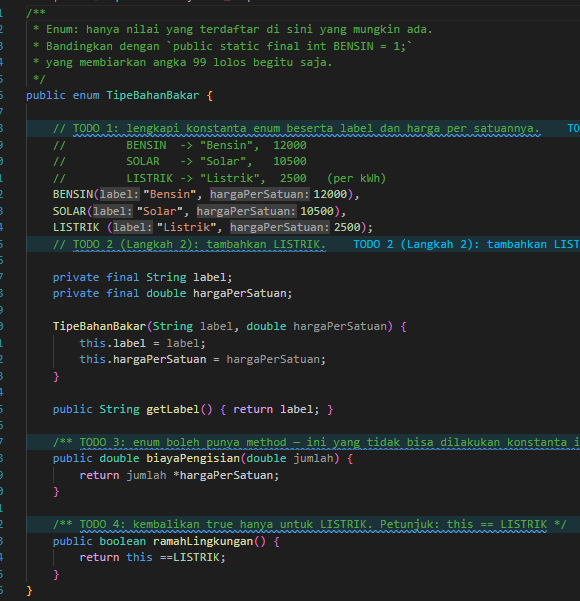

*Tiga konstanta dan dua method perilaku sudah dilengkapi.*

### 1.7. File: `Main.java`
**Penjelasan Kode:**
> Menjalankan semua `Movable` (Mobil dan Sepeda) lewat `List.of(...)`, lalu `isiPenuh(Fuelable)` yang parameternya bertipe interface sehingga hanya objek `Fuelable` yang diterima. Baris `isiPenuh(sepeda)` sengaja dibiarkan sebagai komentar karena akan gagal kompilasi. Bagian terakhir mencetak semua nilai enum beserta perilakunya.

**Bukti Eksekusi (Screenshot):**
* **Before** *(Kondisi awal / Kesalahan kompilasi)*:
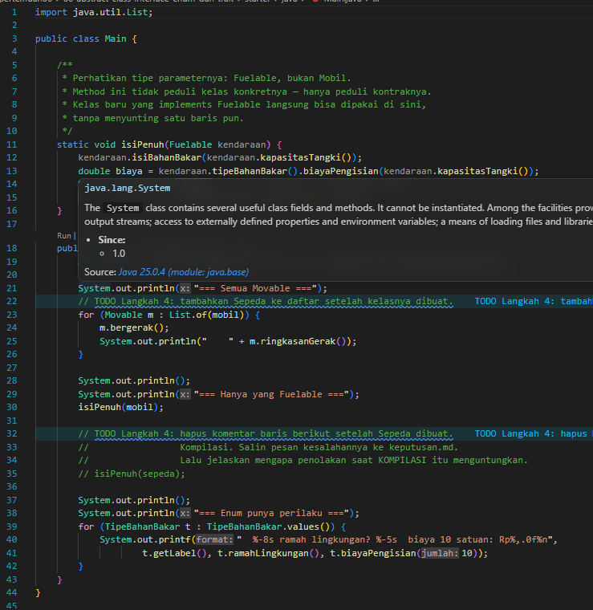

*Kondisi awal: Sepeda belum ada di daftar `Movable`.*

* **After** *(Kondisi akhir / Eksekusi berhasil)*:
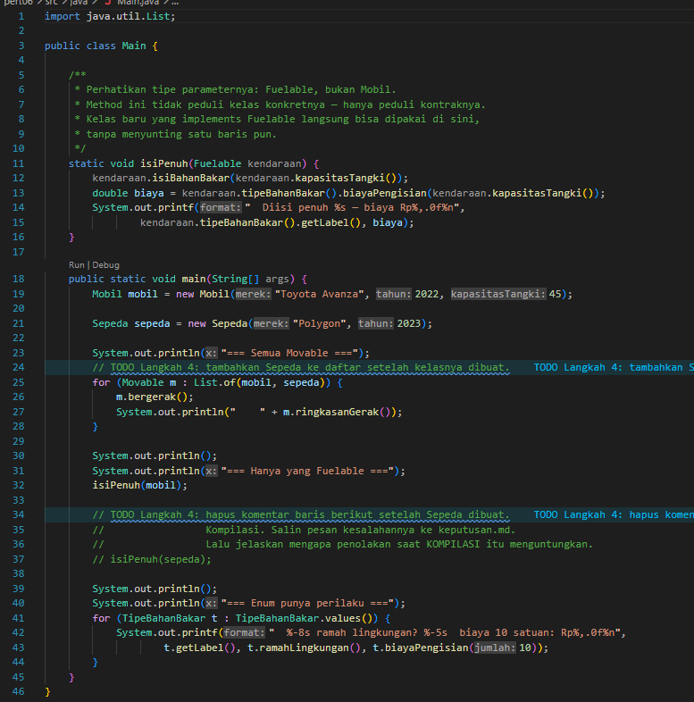

*Sepeda sudah ada di daftar, dan `isiPenuh()` hanya dipanggil untuk `mobil`.*

### Output
**Output Program:**
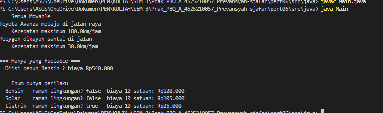

*Setelah dilengkapi, Mobil dan Sepeda bergerak dengan kecepatan maksimum 180,0 dan 30,0 km/jam, pengisian penuh Bensin 45 satuan berbiaya Rp540.000, dan enum menampilkan Listrik sebagai satu-satunya yang ramah lingkungan.*

**Pembanding, output sebelum kode dilengkapi:**
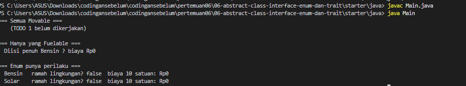

*Sebelum dilengkapi, ringkasan gerak menampilkan "TODO 1 belum dikerjakan", biaya Rp0, dan enum `LISTRIK` belum ada.*

---

## 2. Implementasi PHP

### 2.1. File: `abstraksi.php`
**Penjelasan Kode:**
> Semua konsep abstraksi PHP ditaruh dalam satu file. Berisi interface `Movable` dan `Fuelable`; backed enum `TipeBahanBakar` (`Bensin`, `Solar`, `Listrik`) dengan method `label()`, `hargaPerSatuan()`, `biayaPengisian()`, dan `ramahLingkungan()` memakai `match`; trait `Loggable` yang mencetak log berformat `[jam] NamaKelas: pesan` memakai `static::class`; abstract class `Kendaraan`; serta `Mobil` dan `Sepeda`. Berbeda dengan Java, interface PHP tidak punya default method, sehingga `Sepeda` tidak mengimplementasikan `Fuelable`.
> Trait `Loggable` dipakai ulang secara horizontal oleh `Mobil` dan `pesanan` yang sama sekali bukan kerabat `Kendaraan`.

**Bukti Eksekusi (Screenshot):**
* **Before** *(Kondisi awal / Galat logika)*:
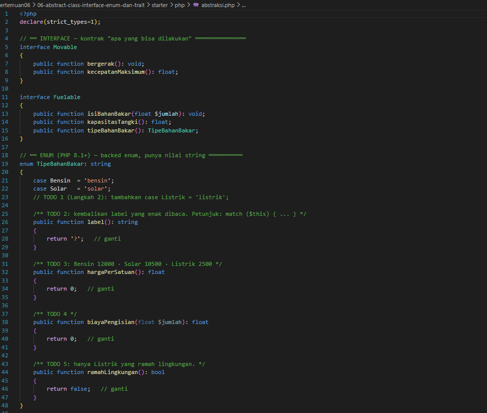
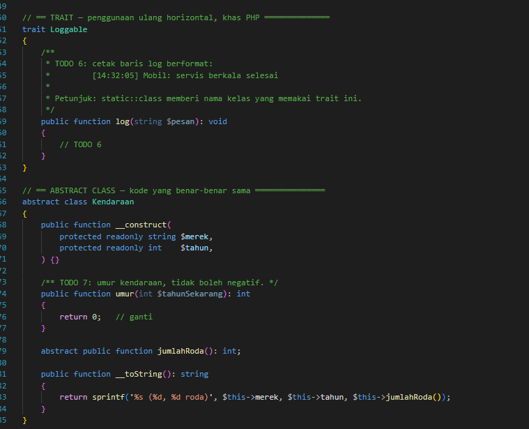
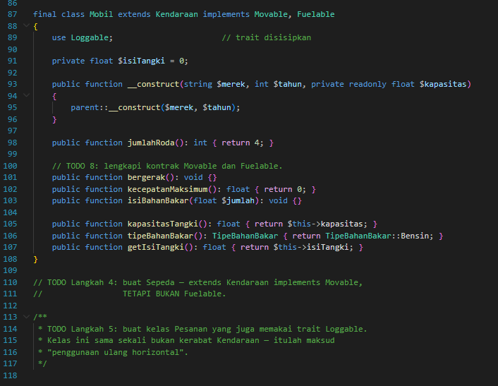

*Kondisi awal (tiga potongan screenshot karena file panjang): kerangka dengan banyak TODO pada enum, trait, `umur()`, `Mobil`, dan `Sepeda`/`Pesanan` yang belum dibuat.*

* **After** *(Kondisi akhir / Eksekusi berhasil)*:
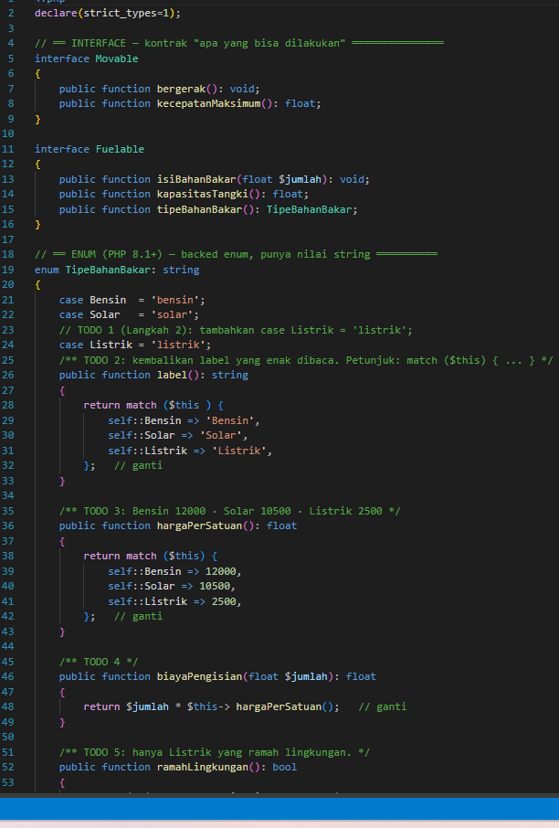

*Seluruh TODO sudah dilengkapi: enum, trait, kelas `Mobil`, `Sepeda`, dan `pesanan`.*

### 2.2. File: `main.php`
**Penjelasan Kode:**
> Program uji PHP. Fungsi `isiPenuh(Fuelable $kendaraan)` hanya menerima objek yang mengimplementasikan `Fuelable`, sehingga `isiPenuh($sepeda)` akan memicu `TypeError` dan dibiarkan sebagai komentar. Selanjutnya program memanggil `bergerak()` pada Mobil dan Sepeda, mencetak perilaku enum (`TipeBahanBakar::cases()`), lalu menunjukkan trait `Loggable` dipakai oleh `Mobil` dan `pesanan`.

**Bukti Eksekusi (Screenshot):**
* **Before** *(Kondisi awal / Galat logika)*:
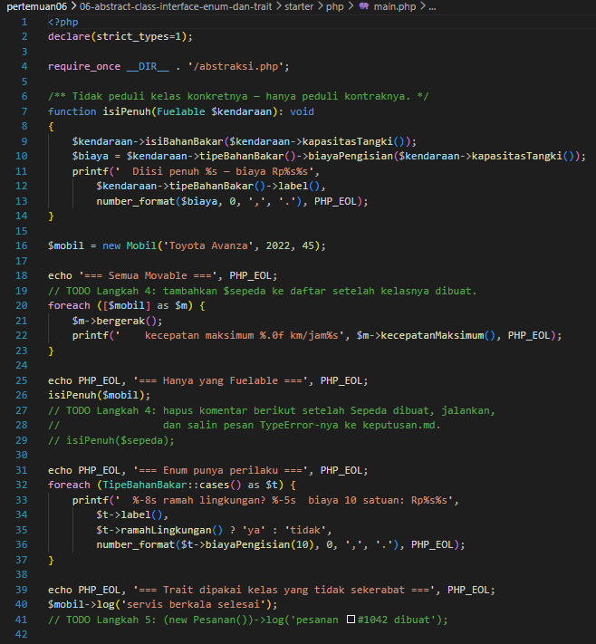

*Kondisi awal: Sepeda belum ada dan sebagian TODO belum dijalankan.*

* **After** *(Kondisi akhir / Eksekusi berhasil)*:
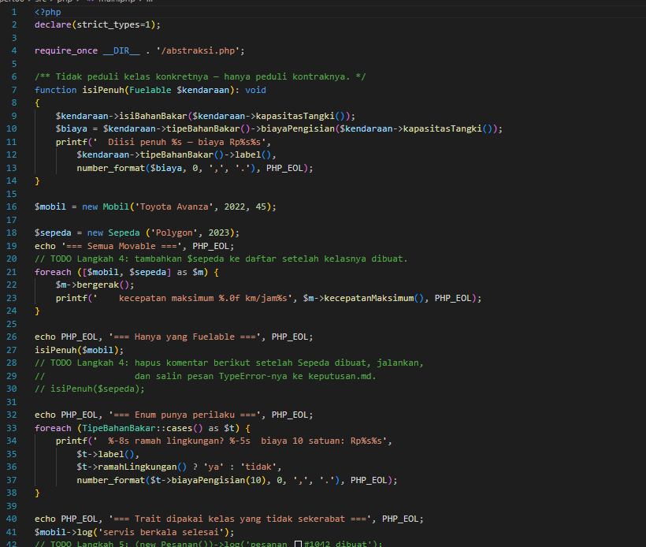

*Sepeda sudah masuk daftar `Movable`, dan trait dipakai oleh dua kelas yang tidak sekerabat.*

### Output
**Output Program:**
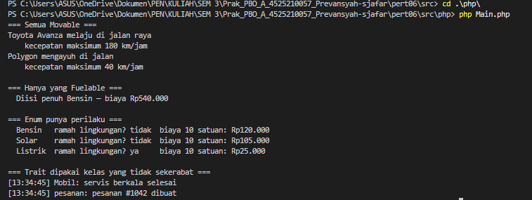

*Setelah dilengkapi, Mobil bergerak dengan kecepatan 180 km/jam dan Sepeda 40 km/jam, pengisian penuh Bensin berbiaya Rp540.000, enum menampilkan tiga tipe bahan bakar dengan Listrik sebagai yang ramah lingkungan, dan trait mencetak log dari `Mobil` dan `pesanan`.*

**Pembanding, output sebelum kode dilengkapi:**
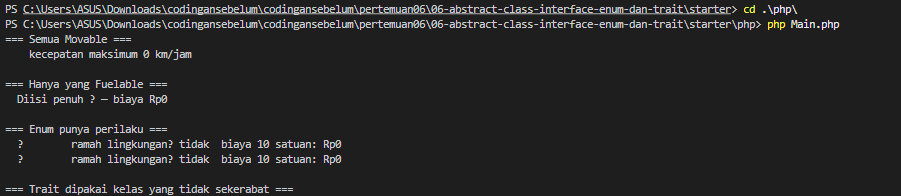

*Sebelum dilengkapi, kecepatan maksimum 0 km/jam, label enum menampilkan "?", dan biaya Rp0.*

---

## 3. Kesimpulan
> Praktikum ini membedakan tiga alat abstraksi. Abstract class (`Kendaraan`) menampung kode dan state yang benar-benar sama. Interface (`Movable`, `Fuelable`) mendefinisikan kemampuan yang bisa dimiliki kelas apa pun, dan dipisah kecil-kecil (Interface Segregation) agar kelas seperti `Sepeda` tidak dipaksa menerima kontrak yang tidak relevan. Satu class hanya boleh mewarisi satu abstract class tetapi boleh mengimplementasikan banyak interface.
> Enum membatasi nilai yang sah dan bisa membawa perilaku (label, harga, `ramahLingkungan()`), lebih aman daripada konstanta `int`. Menolak `isiPenuh(sepeda)` saat kompilasi (Java) atau lewat `TypeError` (PHP) lebih menguntungkan daripada gagal diam-diam. Pada PHP, trait `Loggable` memungkinkan penggunaan ulang kode horizontal oleh kelas yang tidak sekerabat, sedangkan Java memakai default method pada interface untuk keperluan serupa.
